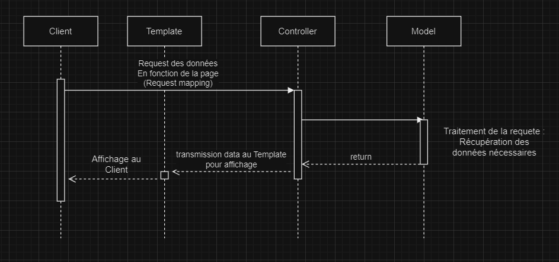
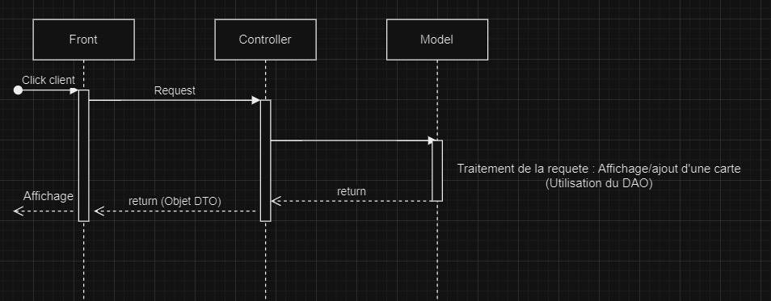
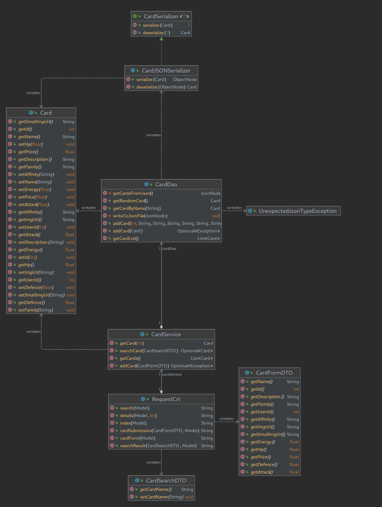

# Atelier 1 - Architecture
### Loan Aubry - Mathias Chatelet Ferrety - Medhy Dohou - Rémy David

## Workflow

### Dynamique

### Statique

## Architecture Dynamique

Nos cartes sont pour l'instant stockés dans un JSON, extrait de l'API de test mis à notre disposition. Son positionnement dans le dossier resources
fait que les changements qui lui sont apportés ne sont PAS PERSISTANTS.

### Digrammes de classes
Notre application respecte bien le pattern MVC : Notre contrôleur, RequestCrt, utilise des Services, pour l'instant, CardService. Ce service se sert de modèles,
dans notre cas, CardDAO, afin d'accéder a nos données. Après extraction de ces données depuis notre base (notre JSON), nous utilisons nos templates thymeleaf (pas représenté ici),
afin de présenter à l'utilisateur les données; Thymeleaf et ses templates constituent donc la vue.
